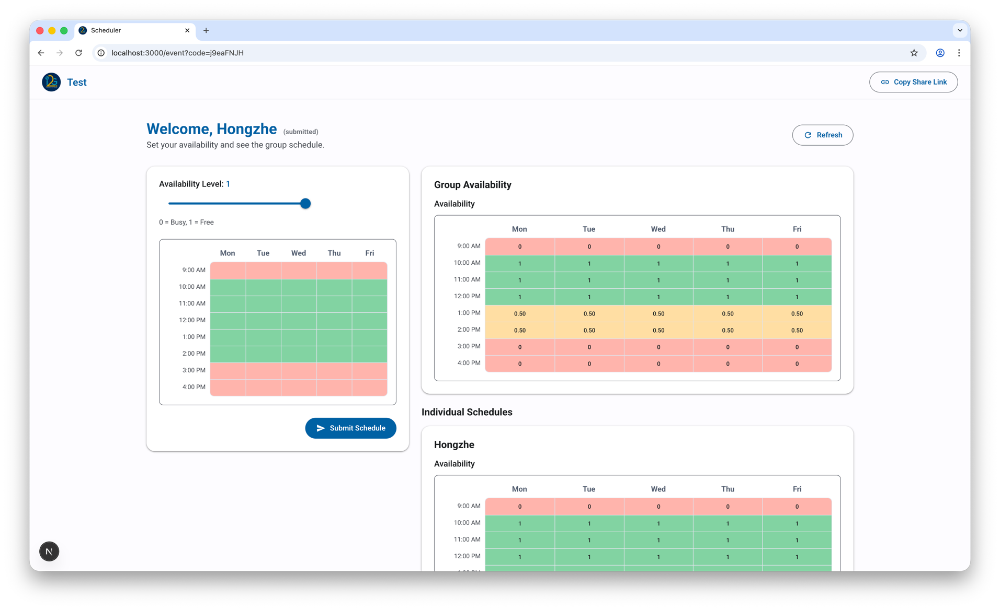

# Scheduler

A group meeting scheduler with weighted availability and real-time aggregation. Create an event, share the link, and find the best time for everyone.



## How to Use

### 1. Create an Event

Go to the home page and fill out the event form:

- **Event Name** — give your meeting a title
- **Organizer Password** — secures access to the organizer dashboard
- **Meeting Type** — In-Person (requires a location) or Virtual
- **Time Range** — set the start and end hours to consider
- **Days** — pick which days of the week are options (defaults to Mon-Fri)

After creating, you'll be redirected to the organizer dashboard.

### 2. Share the Link

Click **Copy Share Link** in the top-right corner to get a link like:

```
https://yoursite.com/event?code=j9eaFNJH
```

Send this to everyone who should participate. No account or sign-up needed.

### 3. Participants Fill In Availability

Each participant:

1. Enters their name and clicks **Join**
2. Uses the **Availability Slider** to pick a level (0 = Busy, 1 = Free, with 0.25 steps)
3. Clicks and drags on the **schedule grid** to paint time slots with that availability level
4. Clicks **Submit Schedule** when done

The grid uses color coding: red (busy) -> yellow (partial) -> green (free).

After submitting, participants can see the **Group Availability** table showing aggregated scores, plus each person's **Individual Schedule** below it.

### 4. Organizer Dashboard

Access the organizer view by appending `&manage=<password>` to the event URL. The organizer can:

- **Set their own availability** on the same grid
- **Adjust participant weights** (0.0-1.0) — higher weight means more influence on the group average
- **Include/exclude participants** from the aggregate calculation
- **Remove participants** from the event
- **View the weighted group average** in real time, updated as weights change

The weighted average formula: for each time slot, `sum(availability * weight) / sum(weights)` across all included participants.

## Tech Stack

| Layer          | Technology                                                                           |
| -------------- | ------------------------------------------------------------------------------------ |
| Frontend       | [Next.js 15](https://nextjs.org/) (App Router) + React 18 + Material Web components |
| Backend        | [Express 5](https://expressjs.com/) (ESM)                                           |
| Database       | [DynamoDB](https://aws.amazon.com/dynamodb/) (events, participants, weights tables)  |
| Infrastructure | AWS ECS Fargate behind ALB (path-based routing)                                      |
| IaC            | Terraform (S3 remote state + DynamoDB lock)                                          |
| CI/CD          | GitHub Actions (lint, test, build, Docker build check, staging deploy)                |

## Project Structure

```
scheduler-monorepo/
  frontend/         # Next.js 15 — UI only, no API routes
  backend/          # Express 5 — API server, DynamoDB
  infra/
    prod/           # Production Terraform (single ECS service, disabled)
    staging/        # Staging Terraform (2 ECS services, ALB path routing)
    bootstrap/      # Terraform state backend setup
  scripts/
    quality-gate.sh # Full lint + test + build for both workspaces
  .github/workflows/
    ci.yml          # Parallel CI for both workspaces
    deploy-staging.yml
```

## Local Development

```bash
npm install          # install all workspace dependencies
npm run dev          # start backend (4000) + frontend (3000)
npm run dev:backend  # backend only
npm run dev:frontend # frontend only
```

The frontend proxies `/api/*` requests to `http://localhost:4000` in dev via `next.config.js` rewrites.

Run checks:

```bash
npm --workspace=backend run lint
npm --workspace=frontend run lint
npm --workspace=backend run test   # 61 tests
npm --workspace=frontend run test  # 9 tests
npm --workspace=frontend run build
npm run quality-gate               # all of the above
```

## Runtime Environment Variables

### Backend

- `PORT` (default: `4000`)
- `AWS_REGION` (default: `us-west-2`)
- `DDB_EVENTS_TABLE` (default: `scheduler-prod-events`)
- `DDB_PARTICIPANTS_TABLE` (default: `scheduler-prod-participants`)
- `DDB_WEIGHTS_TABLE` (default: `scheduler-prod-weights`)

### Frontend

- `NEXT_PUBLIC_API_BASE_URL` — API base URL (empty = relative paths via proxy)
- `BACKEND_URL` — dev proxy target (default: `http://localhost:4000`)

## Docker

```bash
# Backend
docker build -t scheduler-backend:local ./backend
docker run --rm -p 4000:4000 \
  -e AWS_REGION=us-west-2 \
  -e DDB_EVENTS_TABLE=scheduler-staging-events \
  -e DDB_PARTICIPANTS_TABLE=scheduler-staging-participants \
  -e DDB_WEIGHTS_TABLE=scheduler-staging-weights \
  scheduler-backend:local

# Frontend
docker build -t scheduler-frontend:local ./frontend
docker run --rm -p 3000:3000 scheduler-frontend:local
```

## Deployment

### Staging

Staging deploys automatically via `deploy-staging.yml` after CI passes on `main`. Architecture:

- **ALB** routes `/api/*` to backend ECS service, everything else to frontend
- **2 ECS Fargate services** (backend on port 4000, frontend on port 3000)
- **3 DynamoDB tables** with `scheduler-staging-` prefix

### Production

Production workflows are disabled (`.yml.disabled` suffix). Cutover from the monolith is planned separately.

### GitHub Actions Variables

- `AWS_REGION` — `us-west-2`
- `AWS_ROLE_ARN` — OIDC deploy role ARN
- `ECR_STAGING_BACKEND` — `scheduler-staging-backend`
- `ECR_STAGING_FRONTEND` — `scheduler-staging-frontend`
